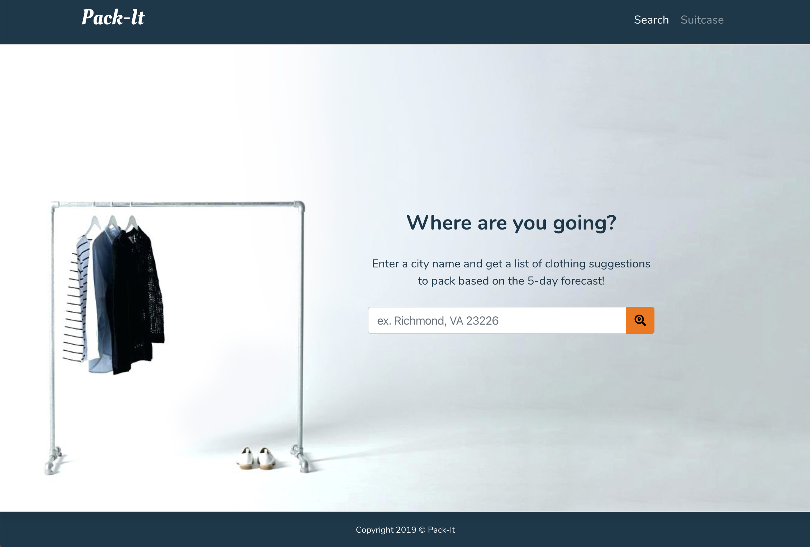
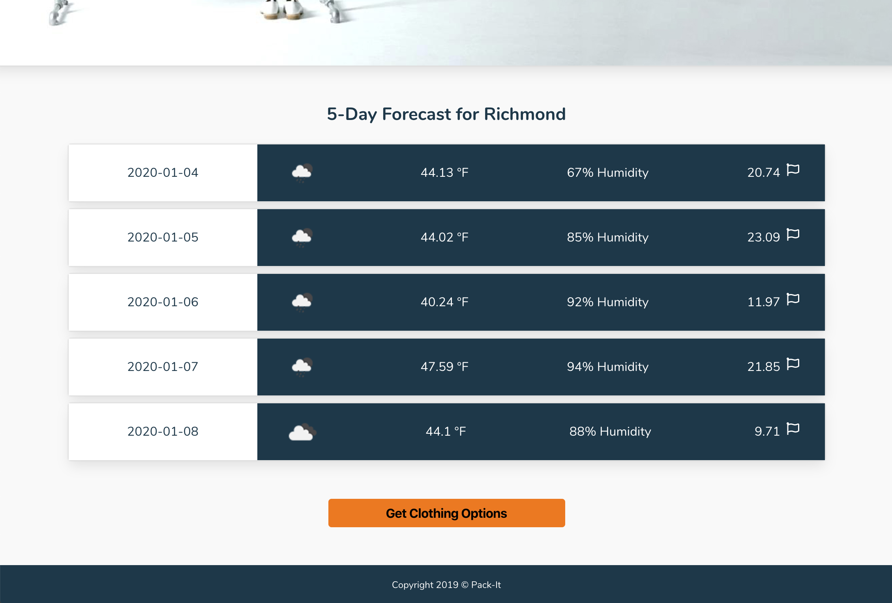
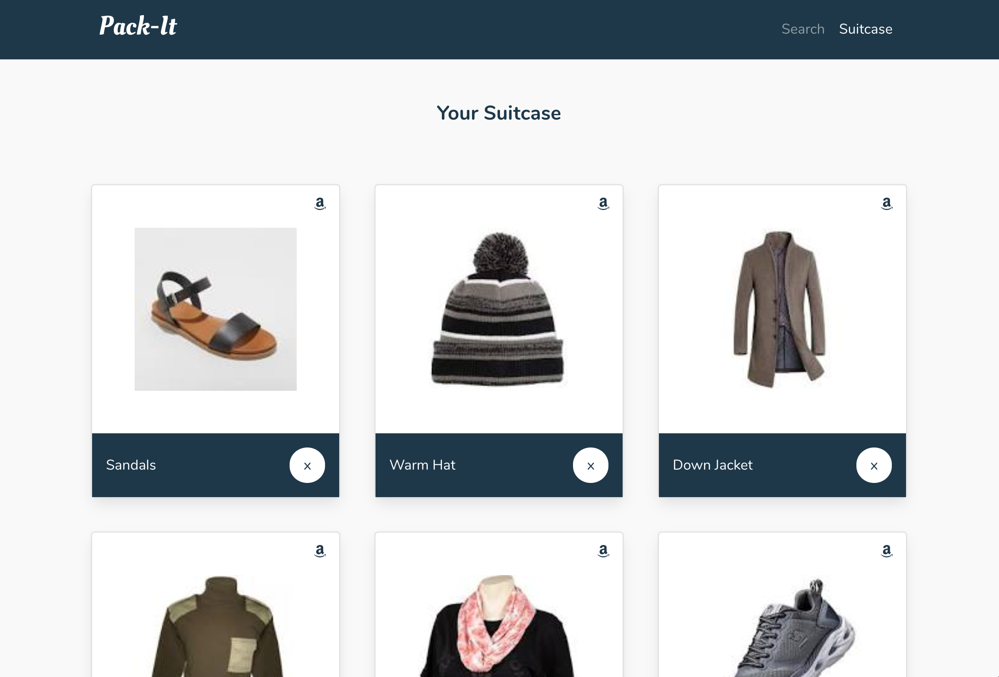

# Pack-It

## Screenshots of Application

## Live Link
- Launch the application [here](https://jonesec2.github.io/Pack-It/)

## Technologies Used
- Programming Languages: HTML5, CSS3, JavaScript/jQuery
- Two server-side APIs: Google custom search API, OpenWeather API
- CSS Frameworks: Bootstrap, Bulma
- Third-party API/Library: Toastr, fontawesome

## Features
- Search a city by name to view the following:
    - 5-day forecast with the following data:
        - Date
        - Icon image (visual representation of weather conditions)
        - Temperature
        - Humidity
        - Wind Speed
- Search history that allows you to:
    - View weather results from previously searched city
- Clothing suggestions based on the 5-day forecast that you can customize by:
    - Adding to suitcase page
    - Removing to suitcase page
- Shop for any items saved to the suitcase page via Amazon

## User Story
- As a traveler:
    - I want to know the weather of the city I am visiting and have suggestions of items to pack
    - I want to be able to save/delete and retrieve items to/from my suitcase
    - I want to be able to customize items in my “suitcase” then later when I am packing, I want to be able to go back to this page and view them again

## Acceptance Criteria
- Given that I provide a valid city name
- When I hit "search"
- then the the 5-day forecast is generated with suggestion of clothing items that I can customize to my "suitcase"
